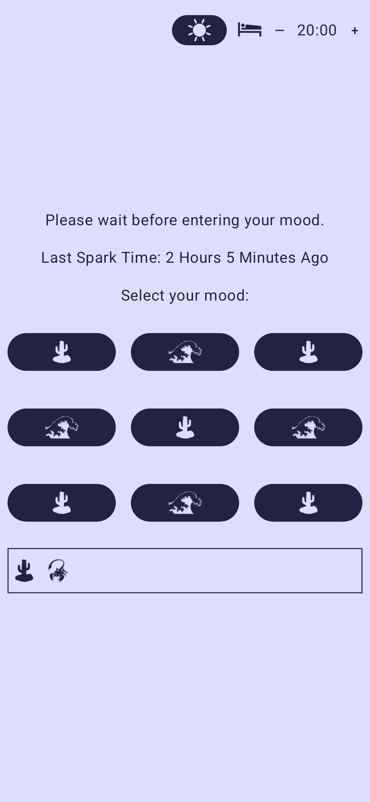
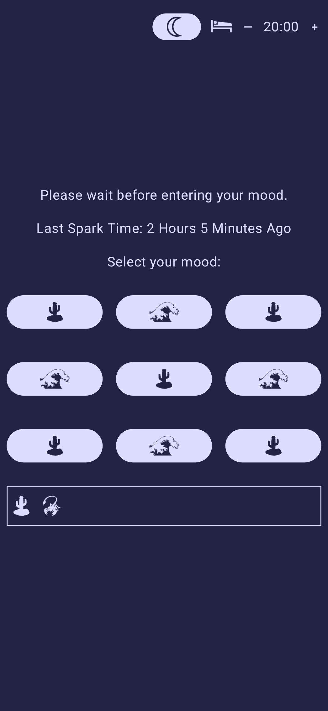

## Spark

This app helps track one's mood on a daily basis.

### Thought Process
* Many people struggle to express how they feel in words, and images are a quick way to check in
* Augmentative and alternative communication (AAC) devices use nested grids of images to help communicate
* This app is inspired by AAC devices, allowing for a selection of whatever "vibe" a user is feeling on a given day
* Minimal taps ensures lower barrier of usage
* Back button allows users to change their mind if they don't see anything that fits

### How The App Works
* 24 hours from the last time you entered your mood, you will be notified that you're Getting Moody
* 48 hours from the last time you ate, you will be notified that you're Very Moody
* Recording any mood in the app will reset the timer
* The last week of data is tracked to see your past moods
* The topmost button allows you to change the UI theme between System/Dark/Light
* The number in the top right is the day threshold hour, adjustable with +/-
  * I recommend setting this to the middle of your usual sleep schedule

### Potential Improvements
* Disable selecting mood if already selected recently (this is unimplemented for testing purposes)
* Add more scenes, for at least 9 total
* Animated scenes, with mood selection for each moving object
* Randomize selectable scenes each day, with a large pool to pick from
  * Keeps the experience from feeling stale
  * This could be an issue if users prefer a handful of scenes
  * Maybe weight scenes higher in selection if moods have been chosen from them before

### Example Screenshots

